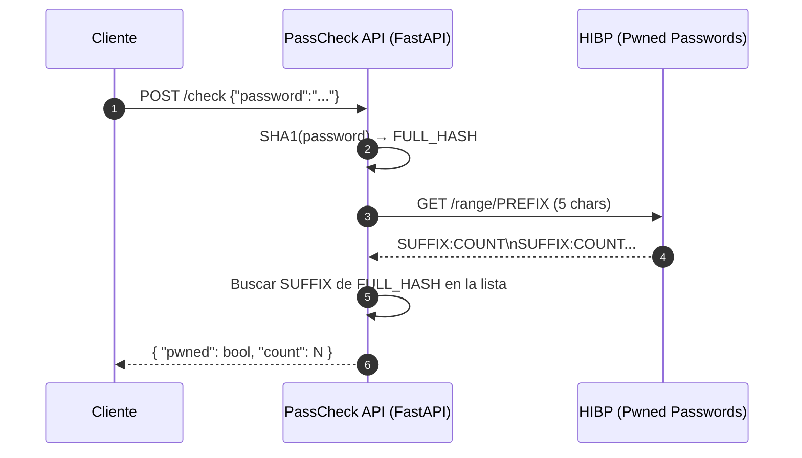

# PassCheck API

Microservicio en **FastAPI** que verifica si una contraseña apareció en brechas públicas usando **k-Anonymity** (Pwned Passwords).  
Privado por diseño: no almacena contraseñas ni hashes completos.

> **¿Por qué en la nube?** Para exponerlo como **servicio HTTP** reutilizable, escalable y observable, integrable en múltiples apps.

---

<strong>Tabla de contenidos</strong>

- [Características](#características)
- [Arquitectura](#arquitectura)
- [Requisitos](#requisitos)
- [Empezar (Local)](#empezar-local)
- [Tests](#tests)
- [Docker](#docker)
- [API](#api)
- [Seguridad](#seguridad)
- [CI/CD](#cicd)
- [Estructura del repo](#estructura-del-repo)
- [Roadmap](#roadmap)
- [Doc del Hito](#doc-del-hito)
- [Licencia](#licencia)

---

## Características

- 🔒 **Privacidad**: SHA-1 solo para el prefijo (k-Anonymity), nada se persiste.  
- ⚡ **Simple**: un endpoint `POST /check`.  
- 🧪 **Calidad**: tests unitarios y de integración (marca `@network`).  
- 🛡️ **Seguridad**: CodeQL, Secret Scanning, Dependabot.  
- 🐳 **Contenedor**: `Dockerfile` minimal listo para deploy.

---

## Arquitectura

Requisitos
Windows (PowerShell/Git Bash) o Linux/macOS

Python 3.11+ y Git

(Opcional) Docker

Empezar (Local)
bash
Copiar código
# 1) Clonar
git clone git@github.com:CarlosGutierrezR/passcheck-api.git
cd passcheck-api

# 2) Entorno
# Windows (PowerShell):  .\.venv\Scripts\Activate.ps1
# Git Bash:              source .venv/Scripts/activate
py -3.11 -m venv .venv
source .venv/Scripts/activate

# 3) Dependencias
python -m pip install --upgrade pip
python -m pip install -r requirements.txt

# 4) Levantar API
python -m uvicorn app.main:app --reload
# → http://127.0.0.1:8000/docs
Tests
bash
Copiar código
# Unit (sin red) — lo que corre el CI
python -m pytest -q -m "not network"

# Integración (usa Internet)
python -m pytest -q -m network
La marca network está registrada en pytest.ini y se excluye del CI.

Docker
bash
Copiar código
# Build
docker build -t passcheck-api:latest .

# Run
docker run -p 8000:8000 passcheck-api:latest
# → http://127.0.0.1:8000/docs

## Enlace de entrega
https://github.com/cvillalonga/CC-25-26/pull/30
-[docs/hito1.md](https://github.com/CarlosGutierrezR/passcheck-api/blob/main/docs/hito1.md)
➡️ docs/hito1.md

Licencia
MIT — ver LICENSE.
