# Hito 1 — Evidencias (Carlos Gutiérrez)

## Entorno y seguridad (GitHub)
- Perfil completo (nombre, ciudad, universidad) y **2FA** activado.
- 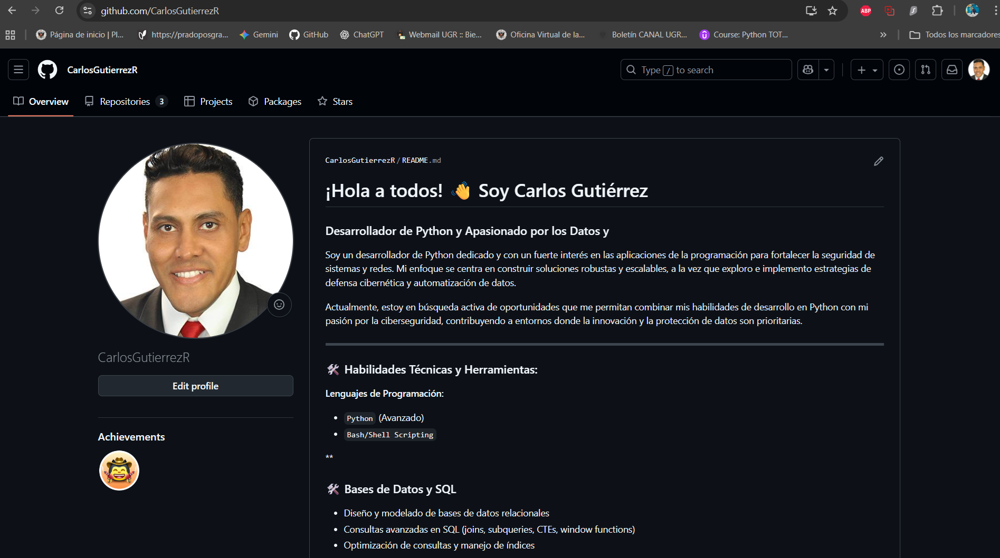
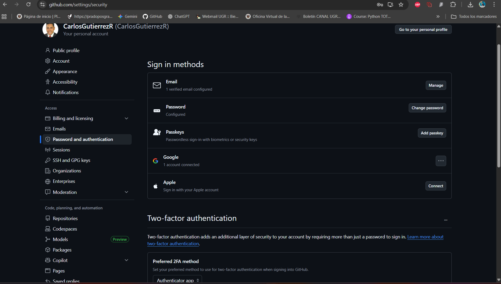

- **SSH** OK: salida de `ssh -T git@github.com` 
- `git config --global user.name` y `user.email` correctos (captura).
- 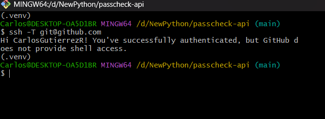
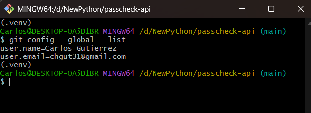

## Repositorio del proyecto
- Estructura mínima creada: `README.md`, `LICENSE`, `.gitignore`, `requirements.txt`, `app/`, `tests/`, `.github/workflows/ci.yml`, `Dockerfile`.
- El **README** explica el problema (basado en servidor, lógica real, beneficio cloud) y **enlaza a este documento**.
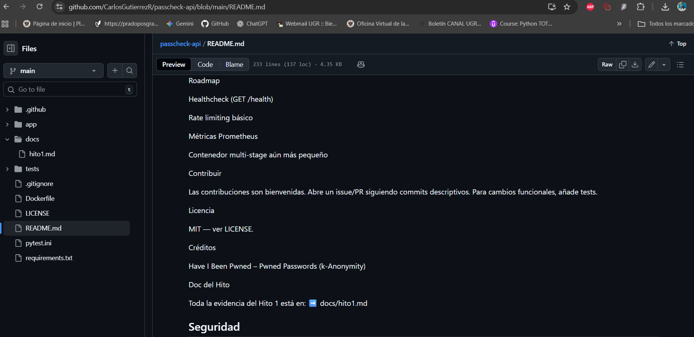

## Buenas prácticas de Git/GitHub
- Milestone **Hito 1** creado.
- Issues creados y cerrados con commits (`closes #N`).
- Commits pequeños y descriptivos. Sin binarios ni generados (uso de `.gitignore`).
- 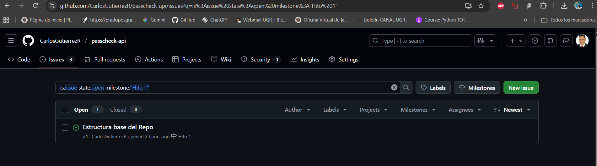
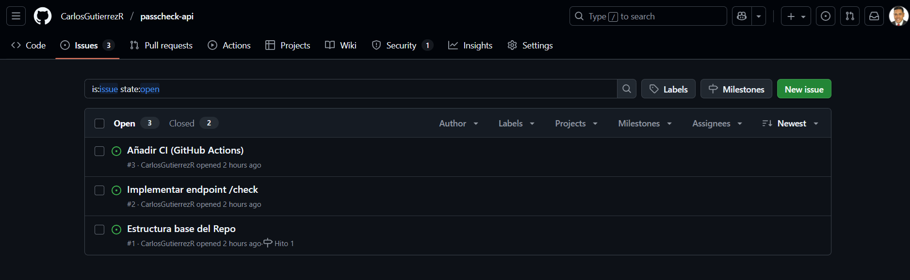
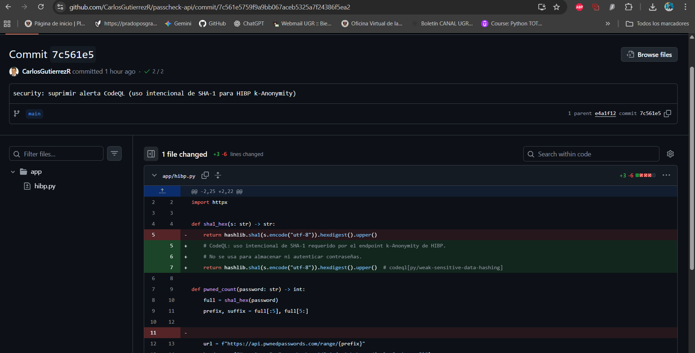

## CI/CD y seguridad
- **GitHub Actions (CI)** ejecuta `pytest` en cada push/PR (captura en verde).
- **Dependabot** configurado para `pip`.
- **CodeQL** activado para Python (alertas en *Security → Code scanning*).
- **Secret scanning** habilitado.
- 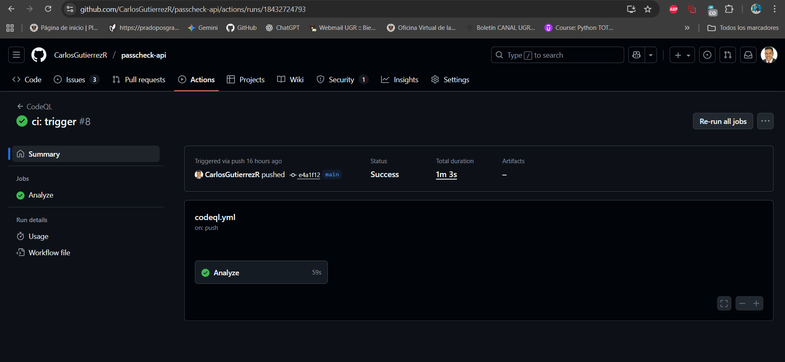
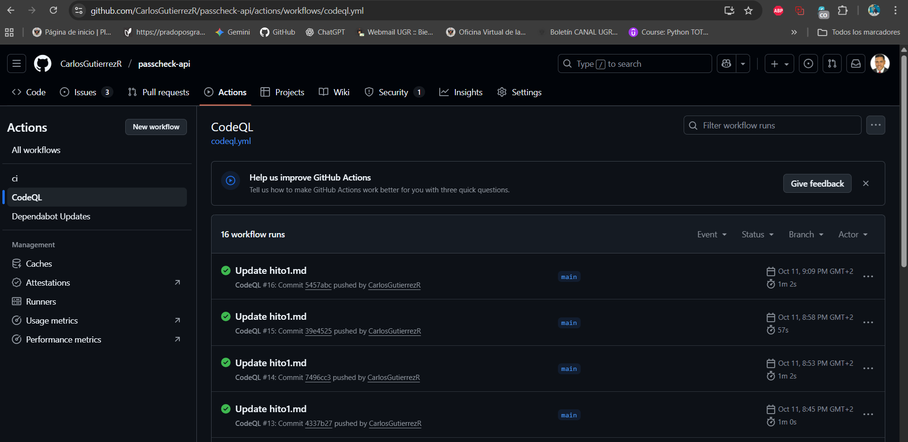
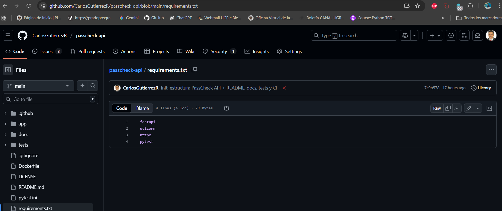
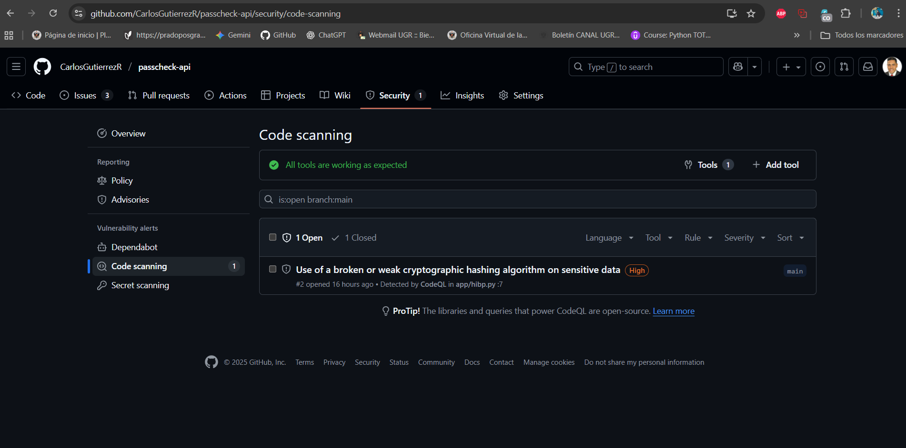

## Pruebas del servicio
- Captura de Swagger `/docs` con `POST /check`.
- Ejemplo de respuesta con `{"password": "password"}` → `{"pwned": true, "count": N}`.
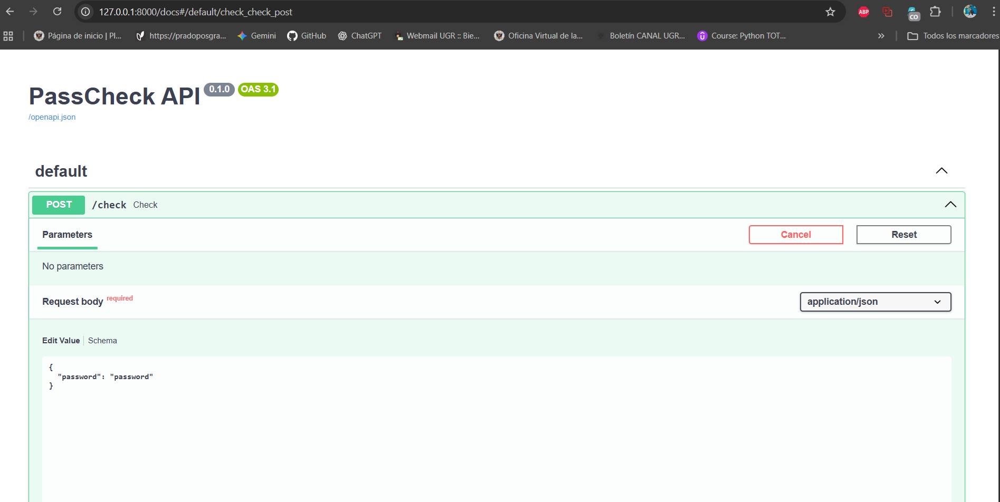
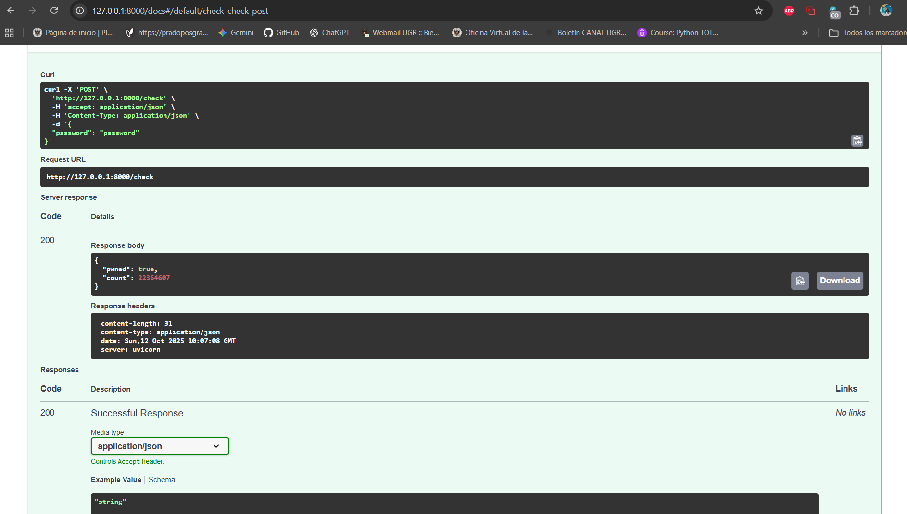

## Política de sincronización (rebase) con el repo de la asignatura

Antes de cada entrega sincronizo **mi fork** con el repositorio de la asignatura usando **rebase** para mantener un historial limpio (sin *merge commits*):

### ✅ 7) Entrega (Fork + PR)

1) https://github.com/cvillalonga/CC-25-26
2) https://github.com/CarlosGutierrezR/passcheck-api/blob/main/docs/hito1.md

## Enlace de entrega
-[docs/hito1.md](https://github.com/CarlosGutierrezR/passcheck-api/blob/main/docs/hito1.md)

