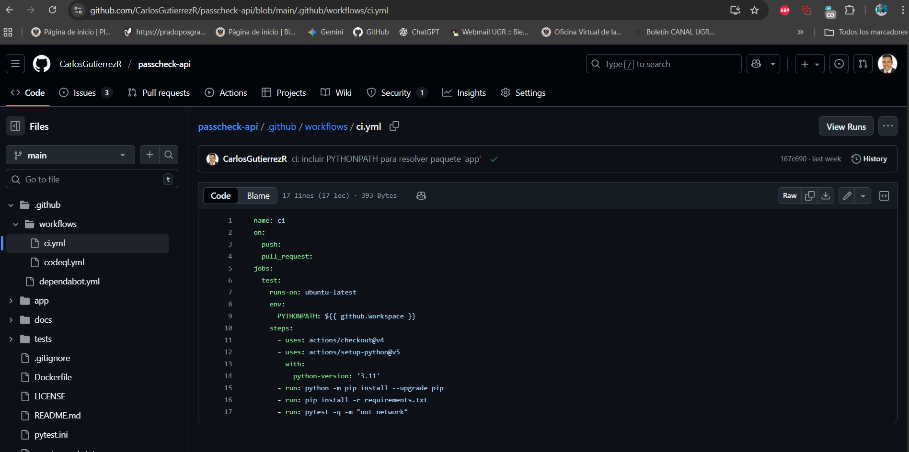
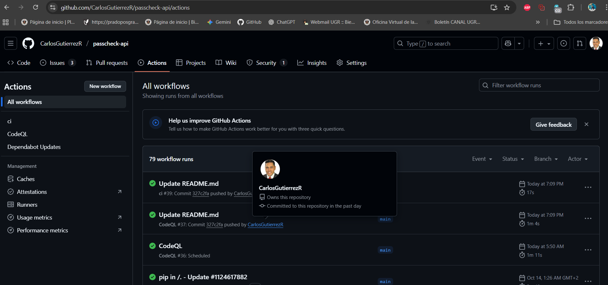
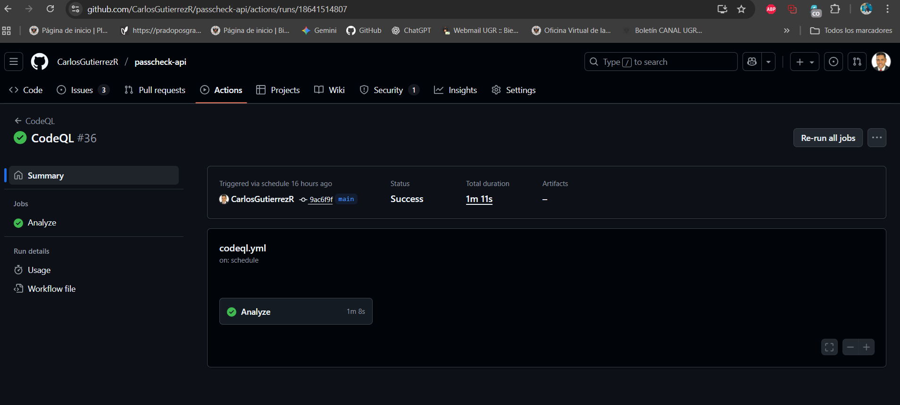
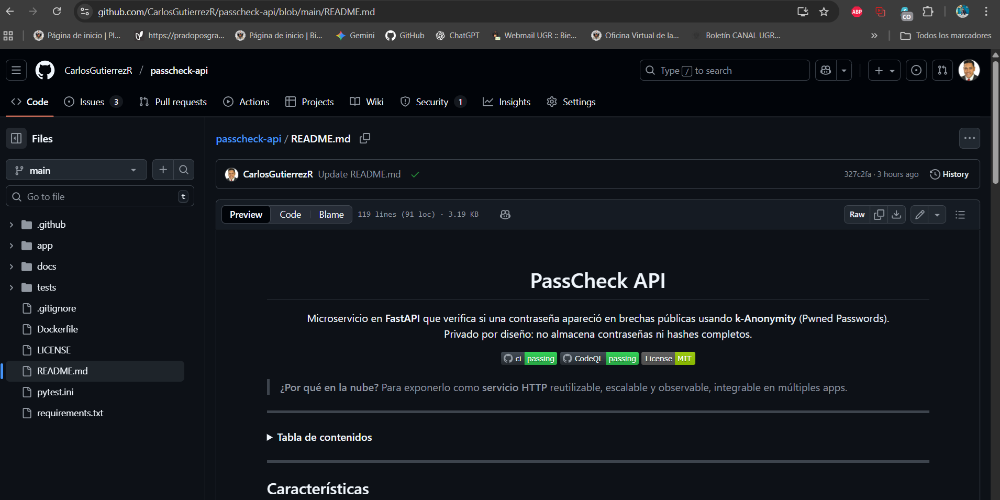

# Hito 2 — Integración Continua (PassCheck API)

## 1) Qué integra el proyecto
- **GitHub Actions** ejecuta automáticamente la verificación del proyecto en cada `push` y `pull_request`.
- El flujo incluye instalación de dependencias y ejecución de pruebas **sin red** para estabilidad del pipeline.
- **Badges** en el README reflejan el estado del CI y de CodeQL.

## 2) Workflow de CI
- Archivo: `.github/workflows/ci.yml`
- Disparadores: `push` y `pull_request`
- Entorno: Ubuntu + Python 3.11
- Pasos esenciales: checkout, setup-python, install deps, `pytest -m "not network"`

**Captura del YAML:**

## 3) Evidencias del pipeline
- **Listado de workflows en verde:**

- **Detalle de un job (instalación y pytest):**

- **Badges visibles en README:**

## 4) Enlaces
- Últimos runs: https://github.com/CarlosGutierrezR/passcheck-api/actions
- Workflow CI: https://github.com/CarlosGutierrezR/passcheck-api/blob/main/.github/workflows/ci.yml
- README: https://github.com/CarlosGutierrezR/passcheck-api/blob/main/README.md

## 5) Entrega (Fork + PR)
- Enlace a este documento: https://github.com/CarlosGutierrezR/passcheck-api/blob/main/docs/hito2.md
https://github.com/CarlosGutierrezR/passcheck-api/pull/6

