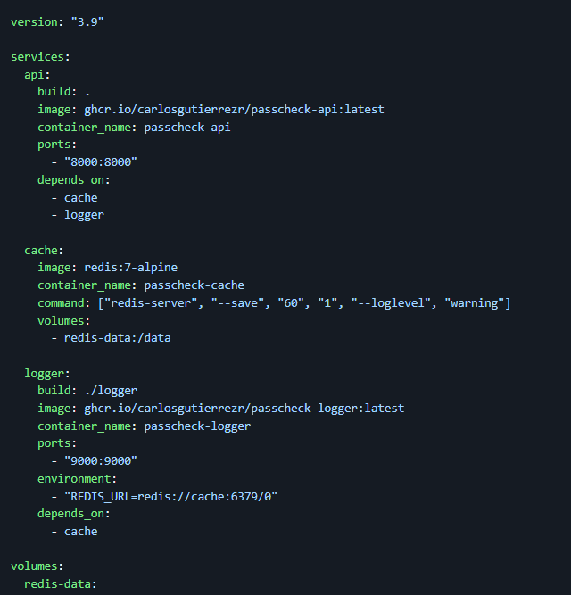
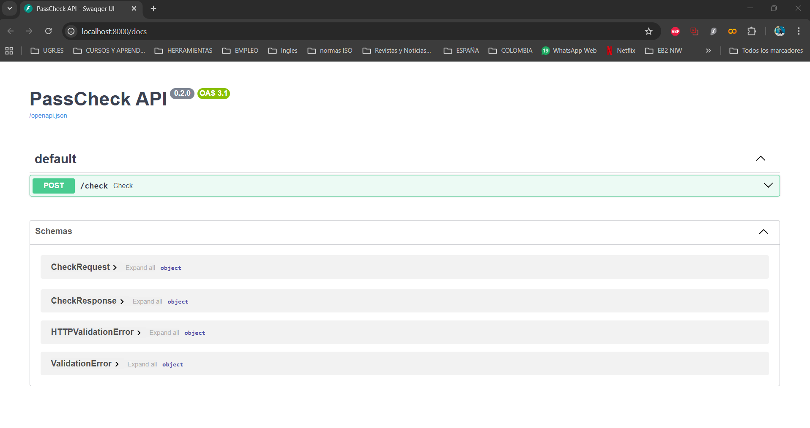
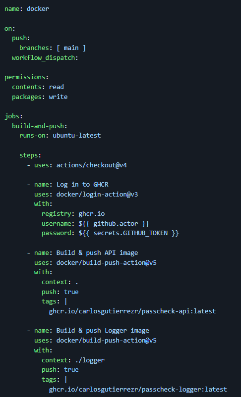
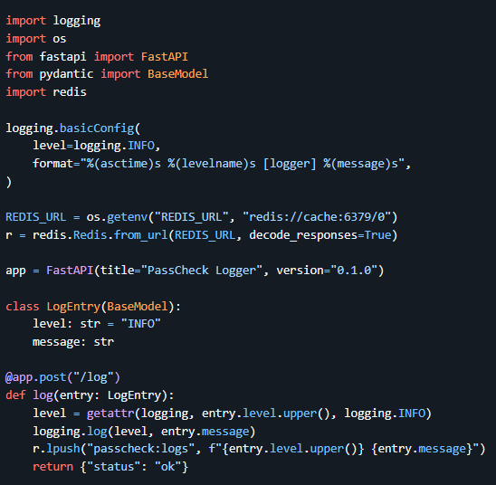
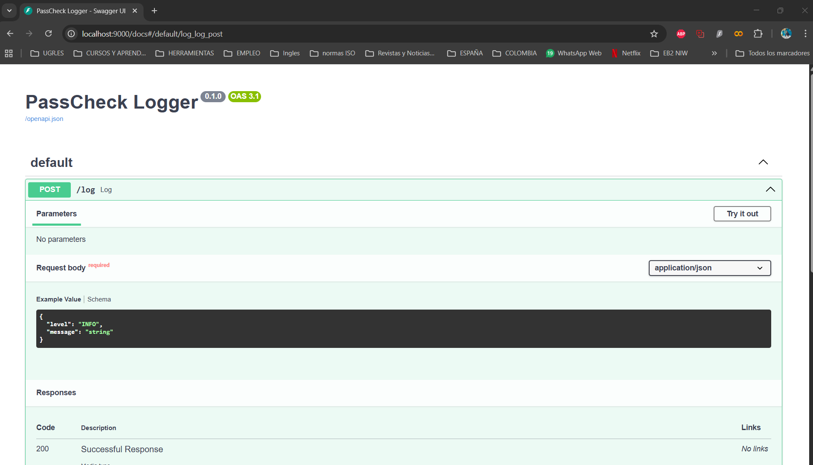
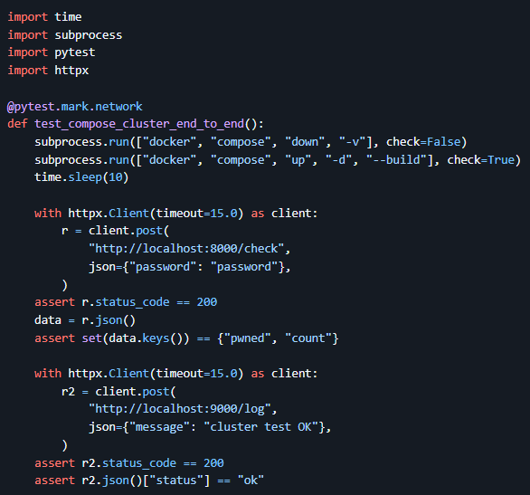

# PassCheck API 🔐

# Hito 4 — Composición de Servicios

Este proyecto implementa un sistema de verificación de contraseñas mediante **microservicios**, **Docker**, **Redis** y **FastAPI**. Está desarrollado como parte de los hitos del curso *Cloud Computing: Fundamentos e Infraestructuras*.

A continuación se muestra la documentación visual del sistema.

---

## 🚀 Arquitectura del clúster (Docker Compose)



---

## 🐳 Arranque del clúster



---

## 📦 Microservicio principal (API)



---

## 📝 Microservicio Logger



---

## 🔧 Estructura del microservicio Logger



---

## 🧪 Test End-to-End del clúster



---

## 📄 Descripción general del proyecto

PassCheck API permite verificar si una contraseña ha sido filtrada previamente en bases de datos públicas mediante la técnica **k-Anonymity HIBP**.

Este proyecto está compuesto por:

* **API principal:** expone el endpoint `/check`.
* **Logger service:** recibe logs vía POST y los almacena en Redis.
* **Redis:** contenedor dedicado exclusivamente al almacenamiento de datos.
* **Workflow CI/CD:** pruebas automáticas y construcción de imágenes Docker.
* **Test del clúster:** levanta todo el entorno y prueba funcionamiento real.

---
Justificación de la elección del framework (FastAPI)

Para implementar el microservicio principal del proyecto evalue diferentes opciones disponibles en el desarrollo backend. Finalmente seleccione **FastAPI**, debido a una ventaja técnica de conocimiento en ciberseguridad que lo convierte en una elección óptima para arquitectura basada en microservicios.

### 🔹 1. Rendimiento superior (ASGI + Starlette)

Para un microservicio que requiere validar múltiples contraseñas y realizar consultas externas (HIBP), la capacidad de procesar solicitudes de manera asíncrona es esencial.

### 🔹 2. Generación automática de documentación (OpenAPI)

FastAPI genera automáticamente:

* Documentación Swagger (`/docs`)
* Documentación ReDoc (`/redoc`)
* Especificación OpenAPI

Esto me permite construir microservicios auto-documentados, lo cual mejora la mantenibilidad y facilita la interacción entre servicios en un entorno distribuido.

### 🔹 3. Tipado fuerte con Pydantic

* Validación automática de datos de entrada
* Modelos consistentes
* Menor probabilidad de errores
* Integración directa con OpenAPI

Esto es clave en un microservicio orientado a recibir parámetros sensibles (contraseñas o hashes).

### 🔹 4. Menor complejidad y mayor velocidad de desarrollo

FastAPI permite desarrollar microservicios limpios y ligeros con muy poco código. Esto es ideal para proyectos modulares basados en contenedores, como el presente, que deben levantarse rápidamente mediante Docker.

---

### Justificación del diseño del microservicio (único endpoint)

El microservicio principal implementa actualmente un único endpoint:

```
POST /check
```
### 🔹 1. Microservicios deben hacer una sola cosa (Single Responsibility Principle)

Este servicio tiene una función clara y única: **verificar si una contraseña ha sido comprometida o filtrada**.

Agregar múltiples funcionalidades dentro del mismo servicio iría en contra de la filosofía de microservicios, donde cada componente debe ser pequeño, autónomo y especializado.

### 🔹 2. Separación clara entre servicios (API vs Logger)

El sistema completo se compone de:

* **API principal** → verificación con HIBP
* **Microservicio Logger** → almacenamiento y registro en Redis
* **Redis** → servicio de persistencia

### 🔹 3. Cumplimiento del alcance del proyecto

El objetivo del hito:

* Contenerizar servicios
* Integrarlos con Docker Compose
* Implementar comunicación entre servicios
* Realizar pruebas de clúster
* Añadir workflows de CI/CD

### 🔹 4. Extensibilidad futura

El diseño actual permite:

* Añadir `/strength` para medir seguridad de contraseñas
* Añadir `/generate` para generar contraseñas seguras
* Añadir `/stats` para métricas

**Conclusión:** La implementación con un único endpoint, creo cumple con los principios de arquitectura y con los requerimientos del hito.

## 📚 Hitos del proyecto

* [Hito 1](docs/hito1.md)
* [Hito 2](docs/hito2.md)
* [Hito 3](docs/hito3.md)
* [Hito 4](docs/hito4.md)

---

## 🛠 Tecnologías usadas

* Python 3.11
* FastAPI
* Docker / Docker Compose
* GitHub Actions
* Redis
* Pytest
* httpx

8) Entrega (Fork + PR)

\- Enlace a este documento: https://github.com/CarlosGutierrezR/passcheck-api/blob/main/docs/hito4.md  

**Entrega:** PR #56 — https://github.com/cvillalonga/CC-25-26/pull/56


