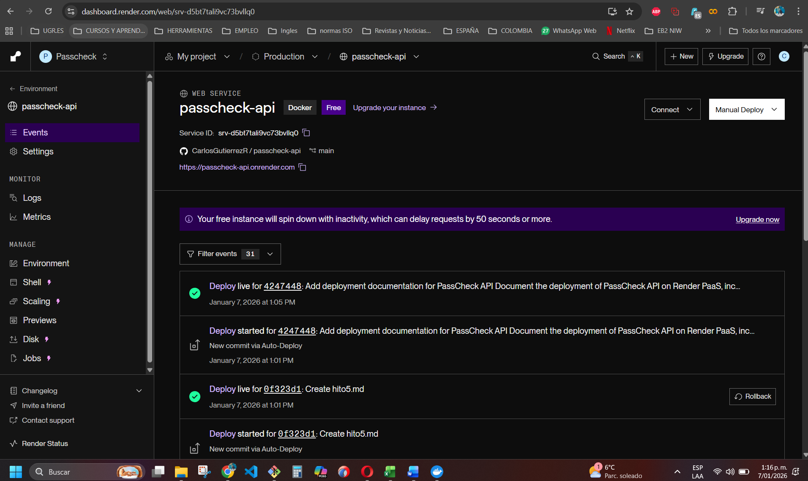

# Hito 5 – Despliegue de la aplicación en un entorno PaaS

## 1. Introducción

En este quinto hito se ha realizado el despliegue de la aplicación **PassCheck API** en un entorno **PaaS (Platform as a Service)**, con el objetivo de publicar el servicio en un entorno cloud real y accesible desde Internet.

El propósito de este hito es validar que la aplicación desarrollada en los hitos anteriores no solo funciona correctamente en local, sino que es **desplegable, operativa y verificable en un entorno de producción**, siguiendo prácticas habituales en entornos profesionales.

---

## 2. Descripción de la aplicación desplegada

La aplicación desplegada es **PassCheck API**, una API REST desarrollada con **FastAPI** que permite comprobar si una contraseña ha aparecido en brechas de seguridad conocidas, utilizando el servicio externo **Have I Been Pwned**.

La API expone los siguientes endpoints principales:

- **POST `/check`**: comprueba si una contraseña ha sido comprometida.
- **GET `/health`**: endpoint de estado para verificar que el servicio está operativo.

Además, la aplicación genera automáticamente documentación **OpenAPI**, accesible mediante **Swagger UI**.

---

## 3. Plataforma PaaS seleccionada

Para el despliegue se ha utilizado la plataforma **Render**, debido a las siguientes ventajas:

- Integración directa con repositorios GitHub  
- Soporte nativo para aplicaciones Docker  
- Asignación automática de puertos mediante la variable `PORT`  
- Certificados HTTPS por defecto  
- Visualización de logs en tiempo real  
- Plan gratuito suficiente para validación académica  

El servicio fue configurado como un **Web Service**, enlazado a la rama `main` del repositorio.

---

## 4. Evidencias del despliegue en Render

### 4.1 Panel del servicio en Render

El panel de Render muestra el servicio **passcheck-api** desplegado correctamente y en estado *Live*.

---

### 4.2 Logs de despliegue y arranque del servicio

Los logs confirman que el contenedor se construyó correctamente, el servidor Uvicorn se inició sin errores y el servicio quedó disponible públicamente.

---

## 5. Verificación de endpoints públicos

### 5.1 Endpoint de salud (`/health`)

El endpoint de verificación de estado responde correctamente indicando que el servicio está operativo.

**URL pública:**

https://passcheck-api.onrender.com/health

**Respuesta obtenida:**

  "status": "ok"

Evidencia:

5.2 Documentación interactiva (Swagger UI)

FastAPI genera automáticamente la documentación interactiva accesible en:

https://passcheck-api.onrender.com/docs

En esta interfaz se pueden visualizar los endpoints disponibles, así como los esquemas de petición y respuesta.

5.3 Especificación OpenAPI

La definición OpenAPI en formato JSON se encuentra disponible públicamente en:

https://passcheck-api.onrender.com/openapi.json

Esta especificación confirma que la API cumple con el estándar OpenAPI 3.1.

6. URLs públicas del servicio

Servicio base:
https://passcheck-api.onrender.com

Health check:
https://passcheck-api.onrender.com/health

Swagger UI:
https://passcheck-api.onrender.com/docs

OpenAPI JSON:
https://passcheck-api.onrender.com/openapi.json

7. Conclusiones

Con la realización de este hito se ha demostrado que la aplicación PassCheck API:

Funciona correctamente en un entorno de producción

Puede desplegarse en un entorno PaaS real

Expone endpoints accesibles públicamente

Dispone de documentación automática estandarizada

Sigue buenas prácticas de despliegue moderno mediante Docker

El uso de Render ha permitido validar un escenario realista de despliegue cloud, completando el ciclo de desarrollo, contenerización y publicación de la aplicación.

