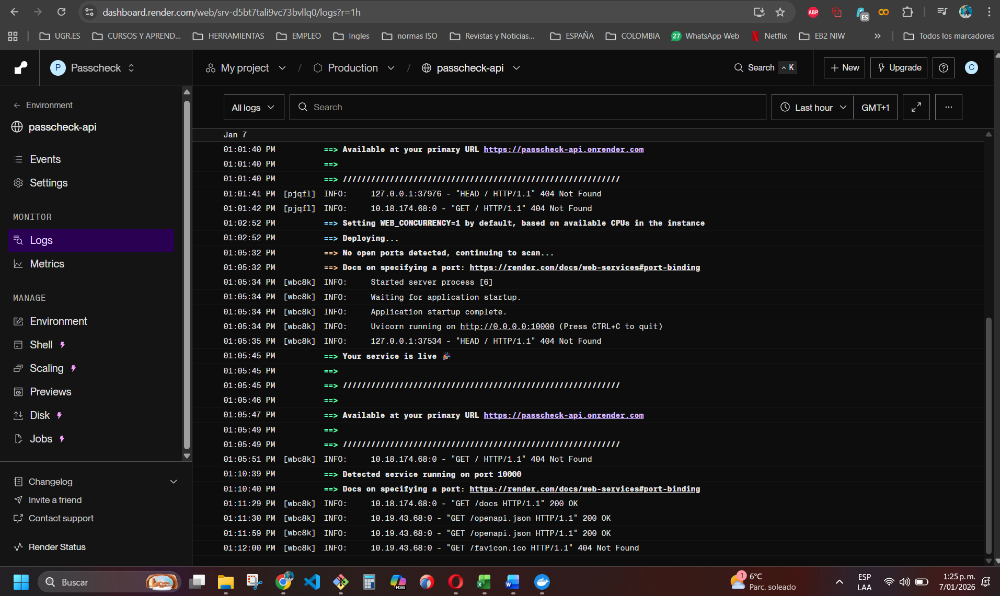

# Hito 5 – Despliegue de la aplicación en un entorno PaaS

## 1. Introducción

En este quinto hito se ha realizado el despliegue de la aplicación **PassCheck API** en un entorno **PaaS (Platform as a Service)**, con el objetivo de publicar el servicio en un entorno cloud real y accesible desde Internet.

El propósito principal de este hito es validar que la aplicación desarrollada en los hitos anteriores no solo funciona correctamente en un entorno local, sino que es **desplegable, operativa y verificable en un entorno de producción**, siguiendo prácticas habituales utilizadas en entornos profesionales.

---

## 2. Descripción de la aplicación desplegada

La aplicación desplegada es **PassCheck API**, una API REST desarrollada con **FastAPI** que permite comprobar si una contraseña ha aparecido en brechas de seguridad conocidas, utilizando el servicio externo **Have I Been Pwned**.

La API expone los siguientes endpoints principales:

- **POST `/check`**: comprueba si una contraseña ha sido comprometida.
- **GET `/health`**: endpoint de estado para verificar que el servicio está operativo.

Además, la aplicación genera automáticamente documentación **OpenAPI**, accesible mediante **Swagger UI**, lo que facilita la exploración y el consumo de la API.

---

## 3. Plataforma PaaS seleccionada

Para el despliegue se ha seleccionado la plataforma **Render**, ya que ofrece:

- Integración directa con repositorios **GitHub**
- Soporte nativo para aplicaciones contenerizadas con **Docker**
- Gestión automática de puertos dinámicos mediante la variable de entorno `PORT`
- Certificados **HTTPS** habilitados por defecto
- Visualización centralizada de logs
- Plan gratuito suficiente para validaciones académicas y técnicas

El servicio se configuró como un **Web Service**, conectado directamente a la rama `main` del repositorio del proyecto.

---

## 4. Evidencias del despliegue en Render

### 4.1 Panel del servicio en Render

En la siguiente imagen se observa el panel de Render con el servicio **passcheck-api** desplegado correctamente y en estado **Live**:

---

### 4.2 Logs de despliegue y arranque del servicio

Los logs del servicio confirman que:

- La imagen Docker se construyó correctamente
- El proceso Uvicorn se inició sin errores
- Render detectó correctamente el puerto asignado dinámicamente
- El servicio quedó disponible públicamente

---

## 5. Verificación de endpoints públicos

### 5.1 Endpoint de salud (`/health`)

El endpoint de verificación de estado responde correctamente indicando que el servicio está operativo.

**URL pública:**
